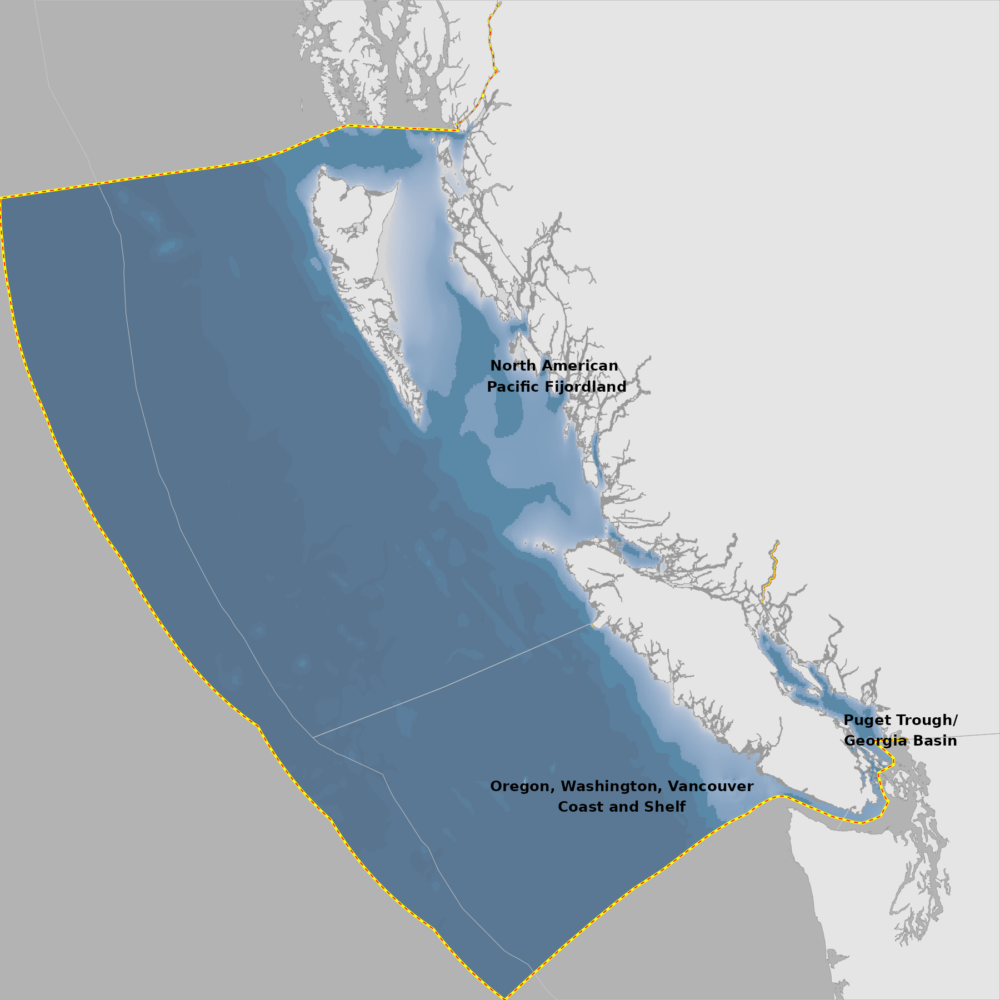
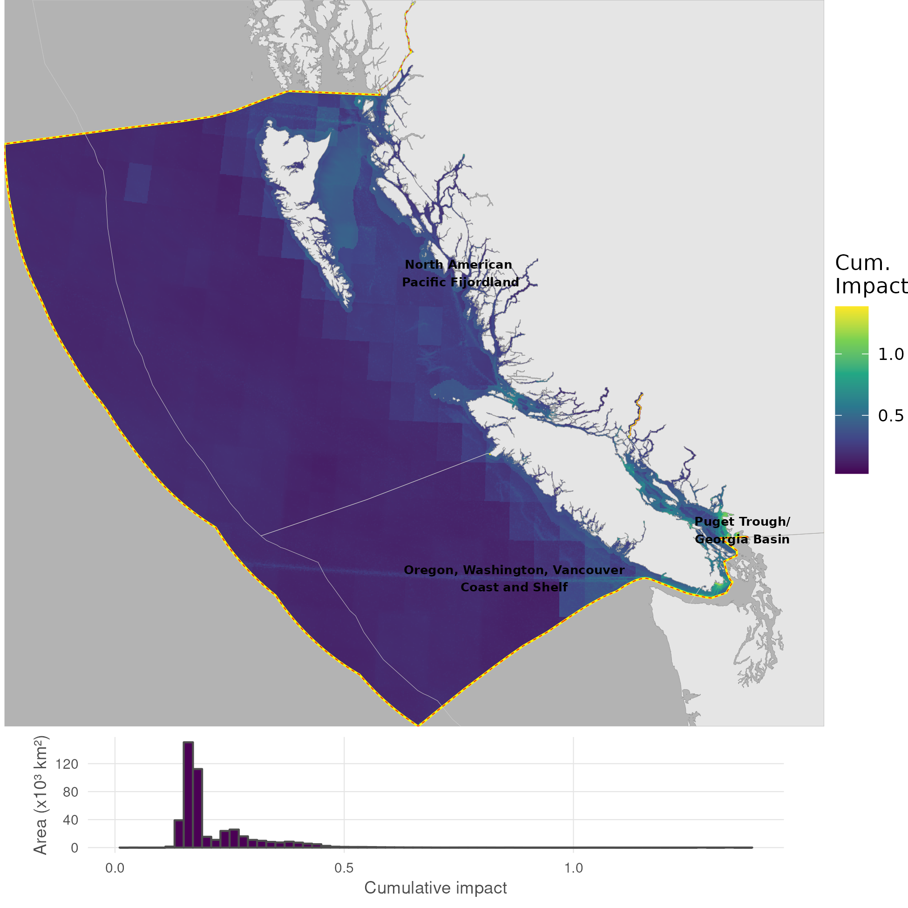

``` {r setup, echo = TRUE, message = FALSE, warning = FALSE}

knitr::opts_chunk$set(echo = TRUE, message = FALSE, warning = FALSE, fig.height = 4, fig.width = 7)

library(terra)
library(sf)
library(oharac)
library(tidyverse)
library(here)
source(here('common_fxns.R'))
source(here('map_fxns.R'))

```

# Summary

Generate a region map, using GEBCO bathymetry for terrain, CAFF boundary for ROI, and EEZ boundaries to show political boundaries.

```{r bathy map}
ocean_r <- rast(here('_spatial/ocean_bc_1km.tif'))

bathy_r_f <- here('_spatial/bathy_bc.tif')

bathy_r <- rast(bathy_r_f)
bathy_r_df <- as.data.frame(bathy_r, xy = TRUE) %>%
  setNames(c('x', 'y', 'depth'))
```

## Plot

```{r}
depth_clrs <- hcl.colors(n = 5, palette = 'Blues 3', rev = TRUE) 
  ### light to dark, shallow to deep

p <- ggplot() +
  geom_raster(data = bathy_r_df, aes(x = x, y = y, fill = log(depth)),
              alpha = .5, show.legend = FALSE) +
  scale_fill_gradientn(colors = depth_clrs)  
p1 <- format_map(p)

pp <- ggdraw() +
  draw_plot(get_panel(p1), x = 0, y = 0, width = 1, height = 1)

ggsave(filename = 'rgn_map.png', 
       width = 6, height = 6, dpi = 300)

```

## Impact map

```{r}
chi_spp_r <- rast(here('_output/cumulative_impact_maps/chi_species.tif'))
chi_spp_df <- as.data.frame(chi_spp_r, xy = TRUE)


p <- ggplot() +
  geom_raster(data = chi_spp_df, aes(x = x, y = y, fill = chi_spp)) +
  scale_fill_viridis_c()

p1 <- p %>%
  format_map() +
  labs(fill = 'Cum.\nImpact')

ggsave(filename = 'chi_spp_map.png', 
       width = 6.75, height = 6, dpi = 300)


```

