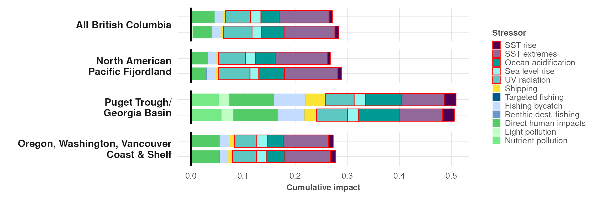

``` {r setup, echo = TRUE, message = FALSE, warning = FALSE}

knitr::opts_chunk$set(echo = TRUE, message = FALSE, warning = FALSE, fig.height = 4, fig.width = 7)

library(terra)
library(oharac)
library(data.table)
library(tidyverse)
library(cowplot)
library(here)
source(here('common_fxns.R'))

```

# Summary

Examine distribution of impacts within ecoregions - broken down by stressor, mean across cells, both unweighted and weighted by species richness.

# Methods

## Load cumulative impact rasters

Build up an analysis dataframe including impact maps for all stressors.  Include additional layers to facilitate examination of impacts by marine ecoregion.

* Load all impact rasters, plus nspp raster and MEOW raster.
* Crop out all cells not in MEOW.
* Group by MEOW and summarize both spp-weighted and unweighted mean impact values across all stressors.

```{r build impact dataframe}
imp_fs <- list.files(here_anx('_output/impact_maps/impact_maps_species'), 
                     pattern = 'impact.+_mean.tif',
                     full.names = TRUE)

lyr_names <- basename(imp_fs) %>%
  str_remove_all('impact_spp_|_x_.+|_mean|.tif')
imp_stack_all <- rast(imp_fs) %>%
  setNames(lyr_names)

nspp_r <- rast(here('_output/nspp_maps/species_richness.tif')) %>%
  setNames('nspp')
meow_r <- rast(here('_spatial/meow_rgns_polar_1km.tif')) %>%
  setNames('meow')

arctic_r <- rast(here('_spatial/ocean_polar_1km.tif')) %>%
  mask(rast(here('_spatial/seaice_mask_0.8.tif')), inverse = TRUE) %>%
  setNames('arctic_mask')

full_stack <- c(imp_stack_all, nspp_r, meow_r) %>%
  mask(arctic_r)

imp_df <- as.data.frame(full_stack)
```

```{r}
imp_by_meow_unwt_df <- imp_df %>%
  select(-nspp) %>%
  group_by(meow) %>%
  summarize(across(.cols = everything(), .fns = mean,
                   .names = '{.col}_mean', na.rm = TRUE),
            ncell = n())

imp_by_meow_nspp_wt_df <- imp_df %>%
  group_by(meow) %>%
  summarize(across(-nspp, 
                   .fns = ~ sum(.x * nspp, na.rm = TRUE) / sum(nspp[!is.na(.x)]),
                   .names = '{.col}_nspp_wt_mean'),
            nspp_mean = mean(nspp),
            ncell = n()) 
```

## Examine impacts by ecoregion

```{r set up impacts by MEOW province and realm}
arctic_meow_vec <- imp_by_meow_unwt_df$meow %>% unique()
meow_prov_df <- foreign::read.dbf(here('_spatial/meow_rgns/meow_rgns.dbf')) %>%
  janitor::clean_names() %>%
  filter(eco_code_x %in% arctic_meow_vec) %>%
  arrange(prov_code) %>%
  mutate(realm_lbl = str_replace(realm, 'Temperate', 'Temp'),
         realm_lbl = str_replace(realm_lbl, 'Northern', 'N'),
         realm_lbl = str_replace(realm_lbl, 'Western', 'W'),
         realm_lbl = str_replace(realm_lbl, 'Eastern', 'E'),
         realm_lbl = str_replace(realm_lbl, 'Central', 'C'),
         realm_lbl = str_replace(realm_lbl, 'Atlantic', 'Atl'),
         realm_lbl = str_replace(realm_lbl, 'Pacific', 'Pac'),
         realm_lbl = fct_inorder(realm_lbl)) %>%
  mutate(prov_lbl = str_replace(province, 'Temperate', 'Temp'),
         prov_lbl = str_replace(prov_lbl, 'North(ern)?', 'N'),
         prov_lbl = str_replace(prov_lbl, '(W|w)est(ern)?', 'W'),
         prov_lbl = str_replace(prov_lbl, '(E|e)ast(ern)?(?!er)', 'E'),
         prov_lbl = fct_inorder(prov_lbl)) %>%
  mutate(meow_lbl = str_replace(ecoregion, 'Temperate', 'Temp'),
         meow_lbl = str_replace(meow_lbl, 'North(ern)?', 'N'),
         meow_lbl = str_replace(meow_lbl, '(W|w)est(ern)?', 'W'),
         meow_lbl = str_replace(meow_lbl, '(S|s)outh(ern)?', 'S'),
         meow_lbl = str_replace(meow_lbl, '(E|e)ast(ern)?(?!er)', 'E'),
         meow_lbl = str_replace(meow_lbl, ' and ', ' & '),
         meow_lbl = str_remove(meow_lbl, ' ?-.+'),
         meow_lbl = ifelse(meow_lbl == 'N Sea', 'North Sea', meow_lbl))

meow_chi_df <- imp_by_meow_unwt_df %>%
  pivot_longer(cols = c(-meow, -ncell)) %>%
  group_by(meow) %>%
  summarize(chi = sum(value)) %>%
  left_join(meow_prov_df, by = c('meow' = 'eco_code_x')) %>%
  arrange(prov_lbl, desc(chi)) %>%
  mutate(meow_lbl = fct_inorder(meow_lbl))

imp_plot_df <- imp_by_meow_unwt_df %>%
  left_join(imp_by_meow_nspp_wt_df) %>%
  select(-nspp_mean, -ncell) %>%
  pivot_longer(-meow, names_to = 'str', values_to = 'imp') %>%
  mutate(weighting = ifelse(str_detect(str, 'nspp'), 'species richness', 'unweighted'),
         weighting = factor(weighting, levels = c('species richness', 'unweighted')),
         str = str_remove_all(str, '_mean.*|_nspp.+')) %>%
  left_join(meow_prov_df, by = c('meow' = 'eco_code_x')) %>%
  mutate(meow_lbl = fct_reorder(meow_lbl, meow)) %>%
  filter(!is.na(meow))
```


### Plot by ecoregion

```{r}
pal_raw <- hcl.colors(n = 5, palette = 'viridis')[c(1, 3, 5, 2, 4)]
pal_mtx <- rbind(colorspace::darken(pal_raw, .3),
                 colorspace::lighten(pal_raw, .2),
                 colorspace::lighten(pal_raw, .6))
pal <- c(pal_mtx)[-9]

cc_strs <- c('sst_extremes', 'ocean_acidification', 'sea_level_rise', 
             'uv_radiation', 'sst_rise')
all_strs <- imp_plot_df$str %>% unique()
str_clrs <- rep(NA, length(all_strs)) %>%
  setNames(all_strs)
str_clrs[cc_strs] <- 'red'

p <- ggplot(data = imp_plot_df, aes(x = imp, y = weighting)) +
  theme_ohara() +
  ### Fill plus outlines for key
  geom_col(aes(fill = str, color = str), 
           width = .8, size = 0.25) +
  ### overlay outlines without fill
  geom_col(aes(color = str), fill = NA,
           width = .8, size = 0.25,
           show.legend = FALSE) +
  facet_grid(rows = vars(meow_lbl), switch = 'y') +
  scale_fill_manual(values = pal, na.value = NA) +
  scale_color_manual(values = str_clrs, na.value = NA) +
  ### draw a vertical line for left-hand axis (impact = 0)
  geom_vline(xintercept = 0, color = 'black') +
  ### clean up theme
  theme(panel.background = element_blank(),
        text = element_text(family = 'Helvetica'),
        legend.text = element_text(size = 6),
        legend.title = element_text(face = 'bold', size = 6),
        legend.key.size = unit(.22, 'cm'),
        strip.text.y.left = element_text(angle = 0, hjust = 1, face = 'bold'),
        strip.background = element_blank(),
        axis.title.y = element_blank(),
        axis.text.y  = element_blank(),
        axis.text.x = element_text(size = 6),
        axis.title.x = element_text(face = 'bold', size = 6, hjust = 0)) +
  labs(x = 'Cumulative impact', fill = 'Stressor', color = 'Stressor')
  
ggsave('ecoregion_impact_summary.png', height = 8, width = 6, units = 'in')


```
