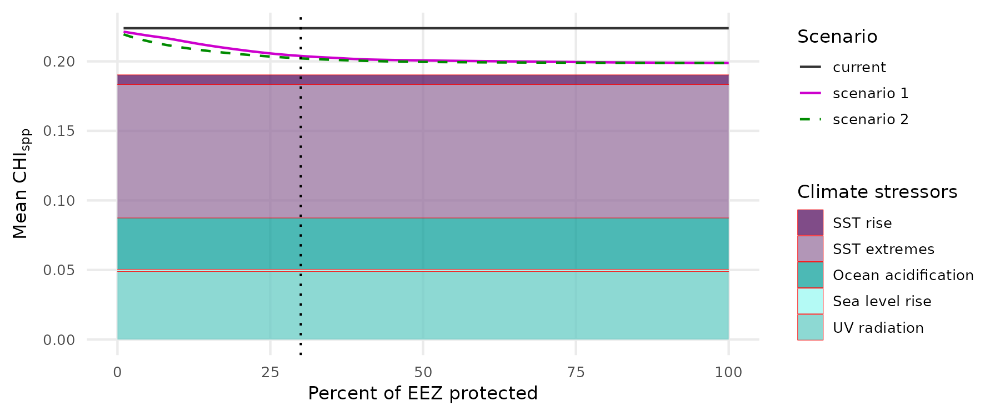
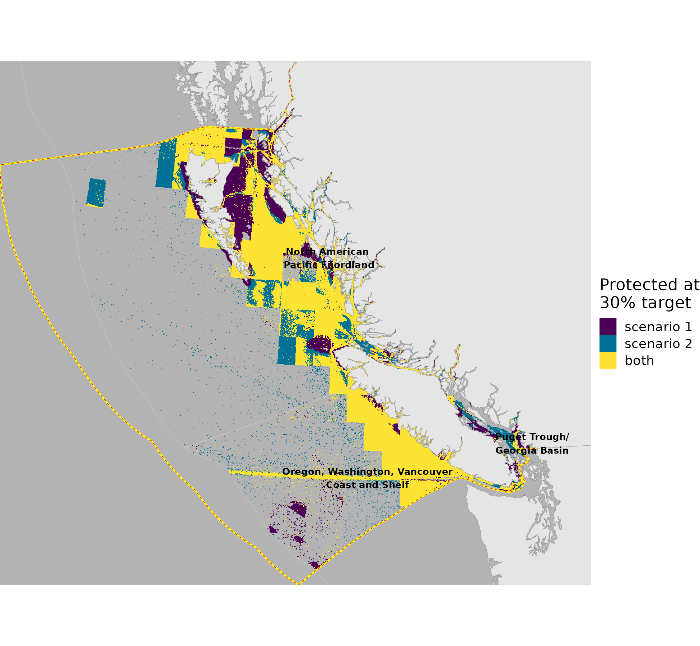

``` {r setup, echo = TRUE, message = FALSE, warning = FALSE}

knitr::opts_chunk$set(echo = TRUE, message = FALSE, warning = FALSE, fig.height = 4, fig.width = 7)

library(terra)
library(sf)
library(oharac)
library(data.table)
library(tidyverse)
library(cowplot)
library(here)
source(here('common_fxns.R'))

```

# Summary

Management effectiveness - how well would MPAs reduce CHI?  

* Scenario 1: for each MEOW (as a proxy to enforce representativeness), rank cells from greatest to least overall CHI. For the most impacted cell, drop all excludable pressures (i.e., set cell as fishery no-take and shipping exclusion zone), and recalculate new CHI. Repeat over cells until 30% of the EEZ/MEOW region is protected. Plot mean CHI as a function of protected area.
* Scenario 2: Same as above, except prioritize protection based on greatest-to-least impacts from fishing and shipping. This should reduce pressures further than scenario 1.
This MPA methodology ignores redistribution of excluded fishing effort or shipping routes, which are not realistic, but predicting new fishing effort or shipping routes seems out of scope.

See https://github.com/mapping-marine-spp-vuln/issues/issues/33

# Methods

## Scenario 1

Create a dataset of cells, grouped by EEZ and MEOW; for each group, rank cells from highest to lowest CHI.  

```{r scenario 1}
### summary file in the same directory as this .Rmd:
chi_spp_sum_f <- 'scenario1_chi_spp.csv'

if(!file.exists(chi_spp_sum_f)) {
  eez_r  <- rast(here('_spatial/ocean_bc_1km.tif')) %>% 
    setNames('eez')
  meow_r <- rast(here('_spatial/meow_rgns_bc_1km.tif')) %>% 
    setNames('meow')
  chi_spp_r <- rast(here('_output/cumulative_impact_maps/chi_species.tif')) %>% 
    setNames('chi_spp')
  
  ### individual impact layers to subtract out of CHI for protection
  fishing_r <- rast(here_anx('_output/impact_maps/impact_maps_species', 
                             'impact_spp_biomass_removal_mean.tif')) %>%
    setNames('fishing')
  bycatch_r <- rast(here_anx('_output/impact_maps/impact_maps_species', 
                             'impact_spp_bycatch_mean.tif')) %>%
    setNames('bycatch')
  shipping_r <- rast(here_anx('_output/impact_maps/impact_maps_species', 
                              'impact_spp_shipping_large_x_wildlife_strike_mean.tif')) %>%
    setNames('shipping')
  trawl_r <- rast(here_anx('_output/impact_maps/impact_maps_species', 
                           'impact_spp_fishing_benthic_dest_x_habitat_loss_degradation_mean.tif')) %>%
    setNames('trawl')
  
  chi_stack <- c(eez_r, meow_r, chi_spp_r, fishing_r, bycatch_r, shipping_r, trawl_r)
  
  chi_df <- as.data.frame(chi_stack, xy = TRUE) %>%
    filter(!is.na(eez) & !is.na(meow))
  
  chi_sum_df <- chi_df %>%
    group_by(eez, meow) %>%
    mutate(pct = ntile(chi_spp, 100)) %>%
    group_by(eez, meow, pct) %>%
    summarize(ncell = n(),
              mean_chi = mean(chi_spp),
              sdev_chi = sd(chi_spp),
              mean_fishing = mean(fishing),
              mean_bycatch = mean(bycatch),
              mean_shipping = mean(shipping),
              mean_trawl = mean(trawl))
  
  write_csv(chi_sum_df, chi_spp_sum_f)
}

```

```{r scenario 1 map}
### summary raster file in the same directory as this .Rmd:
chi_spp_map_f <- 'scenario1_chi_spp.tif'

if(!file.exists(chi_spp_map_f)) {
  eez_r  <- rast(here('_spatial/ocean_bc_1km.tif')) %>% 
    setNames('eez')
  meow_r <- rast(here('_spatial/meow_rgns_bc_1km.tif')) %>% 
    setNames('meow')
  chi_spp_r <- rast(here('_output/cumulative_impact_maps/chi_species.tif')) %>% 
    setNames('chi_spp')

  ### individual impact layers to subtract out of CHI for protection
  fishing_r <- rast(here_anx('_output/impact_maps/impact_maps_species', 
                             'impact_spp_biomass_removal_mean.tif')) %>%
    setNames('fishing')
  bycatch_r <- rast(here_anx('_output/impact_maps/impact_maps_species', 
                             'impact_spp_bycatch_mean.tif')) %>%
    setNames('bycatch')
  shipping_r <- rast(here_anx('_output/impact_maps/impact_maps_species', 
                              'impact_spp_shipping_large_x_wildlife_strike_mean.tif')) %>%
    setNames('shipping')
  trawl_r <- rast(here_anx('_output/impact_maps/impact_maps_species', 
                           'impact_spp_fishing_benthic_dest_x_habitat_loss_degradation_mean.tif')) %>%
    setNames('trawl')
  
  chi_stack <- c(eez_r, meow_r, chi_spp_r, fishing_r, bycatch_r, shipping_r, trawl_r)
  
  chi_df <- data.frame(values(chi_stack)) %>%
    mutate(cell_id = 1:n()) %>%
    filter(!is.na(eez) & !is.na(meow))
  
  chi_top30_df <- chi_df %>%
    group_by(eez, meow) %>%
    mutate(pct = ntile(chi_spp, 100),
           pct_prot = 100 - pct) %>%
    ungroup() %>%
    filter(pct_prot <= 30)
  
  chi_top30_r <- map_to_bc(chi_top30_df, which = 'pct_prot')
  chi_top30_r[is.na(chi_top30_r)] <- 0
  chi_top30_r <- chi_top30_r %>%
    mask(rast(here('_spatial/ocean_bc_1km.tif')))
  
  writeRaster(chi_top30_r, chi_spp_map_f)
}

```

To analyze by EEZ, take the cell-weighted mean of each MEOW within the EEZ (according to matching percentage, i.e., at 15% of each MEOW protected with the EEZ).  Iterate over percentages from 0% to 30% of EEZ protected, comparing the total mean CHI to the MPA-adjusted mean CHI.

```{r scenario 1 summary}
chi_sum_df <- read_csv(chi_spp_sum_f) %>%
  filter(eez < 255)

summarize_by_eez <- function(pct_prot, df) {
  chi_adj_df <- df %>%
    mutate(chi_red = mean_fishing + mean_bycatch + mean_shipping + mean_trawl) %>%
    mutate(protected = 100 - pct <= pct_prot) %>%
    mutate(chi_adj = ifelse(protected, mean_chi - chi_red, mean_chi))
  
  eez_sum <- chi_adj_df %>%
    group_by(eez) %>%
    summarize(chi_mean = sum(mean_chi * ncell) / sum(ncell),
              chi_adj_mean = sum(chi_adj * ncell) / sum(ncell)) %>%
    mutate(pct_prot = pct_prot)
  
  return(eez_sum)
}

eez_prot_sum <- lapply(1:100, summarize_by_eez, df = chi_sum_df) %>%
  bind_rows() %>%
  pivot_longer(names_to = 'scenario', values_to = 'chi_mean', starts_with('chi')) %>%
  mutate(scenario = ifelse(scenario == 'chi_mean', 'current', 'scenario 1'))
  
```

## Scenario 2

Similar to Scenario 1, except this time rank not by *total* CHI but CHI of impacts excludable by MPAs...  NOTE: if total area of cells in an EEZ impacted by fishing/trawling/bycatch/shipping adds up to less than 30%, don't assign protection to zero-impact cells!

```{r scenario 2}
### summary file in the same directory as this .Rmd:
chi_spp_sum2_f <- 'scenario2_chi_spp.csv'

if(!file.exists(chi_spp_sum2_f)) {
  eez_r  <- rast(here('_spatial/ocean_bc_1km.tif')) %>% 
    setNames('eez')
  meow_r <- rast(here('_spatial/meow_rgns_bc_1km.tif')) %>% 
    setNames('meow')
  chi_spp_r <- rast(here('_output/cumulative_impact_maps/chi_species.tif')) %>% 
    setNames('chi_spp')

  ### individual impact layers to subtract out of CHI for protection
  fishing_r <- rast(here_anx('_output/impact_maps/impact_maps_species', 
                             'impact_spp_biomass_removal_mean.tif')) %>%
    setNames('fishing')
  bycatch_r <- rast(here_anx('_output/impact_maps/impact_maps_species', 
                             'impact_spp_bycatch_mean.tif')) %>%
    setNames('bycatch')
  shipping_r <- rast(here_anx('_output/impact_maps/impact_maps_species', 
                              'impact_spp_shipping_large_x_wildlife_strike_mean.tif')) %>%
    setNames('shipping')
  trawl_r <- rast(here_anx('_output/impact_maps/impact_maps_species', 
                           'impact_spp_fishing_benthic_dest_x_habitat_loss_degradation_mean.tif')) %>%
    setNames('trawl')
  
  chi_stack <- c(eez_r, meow_r, chi_spp_r, fishing_r, bycatch_r, shipping_r, trawl_r)
  
  chi_df <- data.frame(values(chi_stack)) %>%
    mutate(cell_id = 1:n()) %>%
    filter(!is.na(eez) & !is.na(meow)) %>%
    mutate(excl_impacts = fishing + bycatch + shipping + trawl)
  
  chi_sum_df <- chi_df %>%
    group_by(eez, meow) %>%
    mutate(pct = ntile(excl_impacts, 100)) %>%
    group_by(eez, meow, pct) %>%
    mutate(pct = ifelse(excl_impacts == 0, 0, pct)) %>%
      ### reassign zero-pressure cells to avoid fake ranking
    summarize(ncell = n(),
              mean_chi = mean(chi_spp),
              sdev_chi = sd(chi_spp),
              mean_fishing = mean(fishing),
              mean_bycatch = mean(bycatch),
              mean_shipping = mean(shipping),
              mean_trawl = mean(trawl))
  
  write_csv(chi_sum_df, chi_spp_sum2_f)
}

```

```{r scenario 2 map}
### summary raster file in the same directory as this .Rmd:
chi_spp_map2_f <- 'scenario2_chi_spp.tif'

if(!file.exists(chi_spp_map2_f)) {
  eez_r  <- rast(here('_spatial/ocean_bc_1km.tif')) %>% 
    setNames('eez')
  meow_r <- rast(here('_spatial/meow_rgns_bc_1km.tif')) %>% 
    setNames('meow')
  chi_spp_r <- rast(here('_output/cumulative_impact_maps/chi_species.tif')) %>% 
    setNames('chi_spp')
  
  ### individual impact layers to subtract out of CHI for protection
  fishing_r <- rast(here_anx('_output/impact_maps/impact_maps_species', 
                             'impact_spp_biomass_removal_mean.tif')) %>%
    setNames('fishing')
  bycatch_r <- rast(here_anx('_output/impact_maps/impact_maps_species', 
                             'impact_spp_bycatch_mean.tif')) %>%
    setNames('bycatch')
  shipping_r <- rast(here_anx('_output/impact_maps/impact_maps_species', 
                              'impact_spp_shipping_large_x_wildlife_strike_mean.tif')) %>%
    setNames('shipping')
  trawl_r <- rast(here_anx('_output/impact_maps/impact_maps_species', 
                           'impact_spp_fishing_benthic_dest_x_habitat_loss_degradation_mean.tif')) %>%
    setNames('trawl')
  
  chi_stack <- c(eez_r, meow_r, chi_spp_r, fishing_r, bycatch_r, shipping_r, trawl_r)
  
  chi_df <- data.frame(values(chi_stack)) %>%
    mutate(cell_id = 1:n()) %>%
    filter(!is.na(eez) & !is.na(meow)) %>%
    mutate(excl_impacts = fishing + bycatch + shipping + trawl)
  
  chi_top30_df <- chi_df %>%
    group_by(eez, meow) %>%
    mutate(pct = ntile(excl_impacts, 100),
           pct_prot = 100 - pct) %>%
    ungroup() %>%
    filter(pct_prot <= 30) %>%
    filter(excl_impacts > 0)
  
  chi_top30_r <- map_to_bc(chi_top30_df, which = 'pct_prot')
  chi_top30_r[is.na(chi_top30_r)] <- 0
  chi_top30_r <- chi_top30_r %>%
    mask(rast(here('_spatial/ocean_bc_1km.tif')))
  
  writeRaster(chi_top30_r, chi_spp_map2_f, overwrite = TRUE)
}

```

```{r unmitigated}
### summary file in the same directory as this .Rmd:
chi_spp_unmitigated_f <- 'unmitigated_chi_spp.csv'

if(!file.exists(chi_spp_unmitigated_f)) {
  eez_r  <- rast(here('_spatial/ocean_bc_1km.tif')) %>% 
    setNames('eez')
  meow_r <- rast(here('_spatial/meow_rgns_bc_1km.tif')) %>% 
    setNames('meow')
  chi_spp_fs <- list.files(here_anx('_output/impact_maps/impact_maps_species'), 
                           pattern = 'mean.tif', full.names = TRUE)
  unmit_fs <- chi_spp_fs[!str_detect(basename(chi_spp_fs), 'biomass|fishing|shipping|bycatch')]
  unmit_nms <- str_remove_all(basename(unmit_fs), 'impact_spp_|_x_.+|_mean.tif')
  unmit_r <- rast(unmit_fs) %>% 
    setNames(unmit_nms)

  chi_unmit_stack <- c(eez_r, meow_r, unmit_r)
  
  chi_unmit_df <- as.data.frame(chi_unmit_stack) 
  chi_unmit_filled_df <- chi_unmit_df %>%
    filter(!is.na(eez) & !is.na(meow)) %>%
    mutate(across(.cols = -c(eez, meow), .fns = ~ifelse(is.na(.x), 0, .x))) %>%
    pivot_longer(cols = -c(eez, meow), names_to = 'stressor', values_to = 'impact') %>%
    group_by(eez, stressor) %>%
    summarize(mean_imp = mean(impact), .groups = 'drop')
  
  chi_unmit_sum_df <- chi_unmit_filled_df %>%
    group_by(eez) %>%
    summarize(chi = sum(mean_imp))
  
  write_csv(chi_unmit_filled_df, chi_spp_unmitigated_f)
}

```

To analyze by EEZ, take the cell-weighted mean of each MEOW within the EEZ (according to matching percentage, i.e., at 15% of each MEOW protected with the EEZ).  Iterate over percentages from 0% to 30% of EEZ protected, comparing the total mean CHI to the MPA-adjusted mean CHI.

```{r}
chi_sum2_df <- read_csv(chi_spp_sum2_f) %>%
  filter(eez < 255)

eez_prot_sum2 <- lapply(1:100, summarize_by_eez, df = chi_sum2_df) %>%
  bind_rows() %>%
  pivot_longer(names_to = 'scenario', values_to = 'chi_mean', starts_with('chi')) %>%
  mutate(scenario = ifelse(scenario == 'chi_mean', 'current', 'scenario 2')) %>%
  ### current should be identical, but dropping zero-value cells messes up the calc!
  filter(scenario != 'current')
  
```

```{r}
chi_unmit_df <- read_csv(chi_spp_unmitigated_f) %>%
  mutate(xmin = 0, xmax = 100) %>%
  pivot_longer(c(xmin, xmax), values_to = 'x', names_to = 'drop_me') %>%
  select(-drop_me)

chi_unmit_cc_df <- chi_unmit_df %>%
  filter(stressor %in% c('ocean_acidification', 'sst_extremes', 'sst_rise',
                         'sea_level_rise', 'uv_radiation')) %>%
  mutate(stressor = str_to_sentence(str_replace_all(stressor, '_', ' ')),
         stressor = str_replace(stressor, 'Sst', 'SST'),
         stressor = str_replace(stressor, 'Uv', 'UV'))
```

```{r plot it}

eez_prot_tot <- bind_rows(eez_prot_sum, eez_prot_sum2) %>%
  mutate(chi_mean = round(chi_mean, 6)) %>%
  distinct()

p <- ggplot(eez_prot_tot, aes(x = pct_prot, y = chi_mean)) +
  geom_area(data = chi_unmit_cc_df, 
            aes(y = mean_imp, x = x, fill = stressor),
            alpha = .5) +
  geom_line(aes(linetype = scenario, color = scenario), size = .25) +
  geom_vline(xintercept = 30, linetype = 'dotted', size = .25) +
  scale_linetype_manual(values = c('solid', 'solid', 'dashed')) +
  scale_color_manual(values = c('grey20', 'red', 'blue')) +
  scale_fill_manual(values = hcl.colors(5)[c(1, 3, 5, 2, 4)]) +
  ylim(c(0, NA)) +
  theme_minimal() +
  theme(text = element_text(size = 8),
        panel.grid.minor = element_blank(),
        legend.key.size = unit(.4, 'cm')) +
  labs(x = 'Percent of EEZ protected', y = 'Mean CHI_{spp}', fill = 'Climate stressors',
       color = 'Scenario', linetype = 'Scenario')

ggsave('mpa_scenarios_0_100.png', width = 6, height = 2.5, dpi = 300)

```

## Plot maps

```{r}
source(here('map_fxns.R'))

s1_r <- rast(chi_spp_map_f)  %>% setNames('scenario1')
s2_r <- rast(chi_spp_map2_f) %>% setNames('scenario2')

scenario_df <- as.data.frame(c(s1_r, s2_r), xy = TRUE) %>%
  filter(scenario1 > 0 | scenario2 > 0) %>%
  mutate(scenario = case_when(scenario1 > 0 & scenario2 == 0 ~ 'scenario 1',
                              scenario1 == 0 & scenario2 > 0 ~ 'scenario 2',
                              scenario1 > 0 & scenario2 > 0  ~ 'both',
                              TRUE ~ 'oops')) %>%
  mutate(scenario = factor(scenario, levels = c('scenario 1', 'scenario 2', 'both')))

p <- ggplot() +
  geom_raster(data = scenario_df, aes(x, y, fill = scenario)) +
  scale_fill_manual(values = hcl.colors(4)[c(1, 2, 4)]) +
  labs(fill = 'Protected at\n30% target')

pp <- format_map(p) + 
  theme(legend.key.size = unit(.4, 'cm'))

ggsave('scenario_map.png', height = 6, width = 6.5)


```

## Check gear restriction effects

Here, we can use the generated summaries by EEZ and MEOW to fully eliminate bycatch and trawl destruction impacts as a first-pass estimate.  Completely eliminating bycatch may overstate the benefit, but if the benefit is very small even when overstated, perhaps additional digging would be unfruitful.

```{r}
chi_sum_df <- read_csv(chi_spp_sum_f) %>%
  group_by(eez) %>%
  summarize(mean_chi = sum(mean_chi * ncell) / sum(ncell),
            mean_byc = sum(mean_bycatch * ncell) / sum(ncell),
            ncell = sum(ncell)) %>%
  mutate(mean_adj_chi = mean_chi - mean_byc,
         pct_reduct = round(mean_byc / mean_chi * 100, 2)) %>%
  select(mean_chi, mean_bycatch = mean_byc, a_km2 = ncell, pct_reduct) %>%
  arrange(-pct_reduct)

knitr::kable(chi_sum_df)
```

