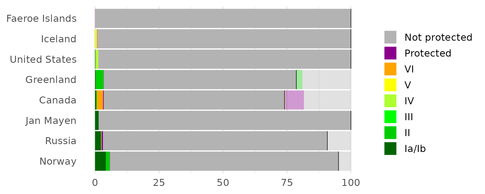

``` {r setup, echo = TRUE, message = FALSE, warning = FALSE}

knitr::opts_chunk$set(echo = TRUE, message = FALSE, warning = FALSE, fig.height = 4, fig.width = 7)

library(terra)
library(sf)
library(oharac)
library(tidyverse)
library(here)
source(here('common_fxns.R'))
source(here('map_fxns.R'))

```

# Summary

Examine status of current MPA estate in Arctic:

* What percent of the circumpolar Arctic is protected by MPAs?
* What percent of each Arctic country’s waters are protected in MPAs?
* For existing MPAs, what are the top remaining stressors to those regions that are not being addressed by MPA regulations?

# Data

https://www.protectedplanet.net/en/thematic-areas/wdpa?tab=WDPA

Metadata: https://www.ibat-alliance.org/pdf/wdpa_manual.pdf

# Analysis

## What percent of the circumpolar Arctic is protected by MPAs?

```{r}
arctic_r <- rast(here('_spatial/ocean_polar_1km.tif')) %>%
  setNames('ocean')
iucn_cat_r <- rast(here('_data/mpa_maps/iucn_category.tif')) %>%
  setNames('iucn_category')
ice_mask <- rast(here('_spatial/seaice_mask_0.8.tif')) %>%
  setNames('seaice')
eez_rast <- rast(here('_spatial/eez_polar_1km.tif')) %>%
  setNames('eez')

mpa_df <- as.data.frame(c(arctic_r, iucn_cat_r, ice_mask, eez_rast),
                        xy = TRUE) %>%
  filter(!is.na(ocean)) %>%
  mutate(seaice = ifelse(is.na(seaice), 0, 1))
```

```{r summary of protection overall}
arctic_mpa_df <- mpa_df %>%
  group_by(iucn_category, seaice) %>%
  summarize(n_cells = n()) %>%
  ungroup()

cat_lvls <- c('Not protected', 'Protected', 
              as.roman(6:2) %>% as.character(), ### II through VI
              'Ia/Ib')
cat_pal <- c('grey70', 'magenta4', 'orange', 'yellow',
             'greenyellow', 'green1', 'green3', 'darkgreen')

protect_level_all <- arctic_mpa_df %>%
  mutate(cat = as.roman(iucn_category) %>% as.character(),
         cat = case_when(cat == 'I'              ~ 'Ia/Ib',
                         is.na(iucn_category)    ~ 'Not protected',
                         !iucn_category %in% 1:6 ~ 'Protected', 
                         TRUE ~ cat),
         tot = sum(n_cells)) %>%
  group_by(cat, seaice) %>%
  summarize(area = sum(n_cells),
            pct = area / first(tot),
            tot = first(tot),
            .groups = 'drop') %>%
  mutate(cat = factor(cat, levels = cat_lvls),
         seaice = factor(seaice)) %>%
  arrange(desc(cat))

plot_df <- protect_level_all %>%
  arrange(seaice, desc(cat)) %>%
  mutate(end = cumsum(pct) * 100, 
         start = cumsum(lag(pct, default = 0) * 100))
ice_lim <- plot_df %>%
  filter(seaice == 0) %>%
  .$end %>% max()

tot_a <- protect_level_all$tot[1] / 1e6

p <- ggplot() +
  geom_linerange(data = plot_df, y = 0,
                 aes(xmin = start, xmax = end, 
                     color = cat, alpha = seaice),
                 size = 40) +
  geom_vline(xintercept = ice_lim, linetype = 'dotted', size = .25) +
  annotate('text', x = ice_lim, y = -.1, label = 'ice > 80%', 
           size = 3, hjust = -.1) +
  scale_color_manual(values = cat_pal) +
  scale_alpha_manual(values = c(1, .4)) +
  guides(alpha = 'none') +
  guides(color = guide_legend(override.aes = list(size = 5))) +
  theme_minimal() +
  ylim(c(-.1, .1)) +
  theme(legend.title = element_blank(),
        axis.title.y = element_blank(),
        axis.text.y = element_blank(),
        panel.grid.major.y = element_blank(),
        panel.grid.minor.y = element_blank(),
        legend.key.size = unit(0.5, 'cm')) +
  labs(x = sprintf('Percent of area (%s million sq km)', round(tot_a, 1)))

ggsave('mpa_protection_full_arctic.png', width = 6, height = 2)

knitr::kable(protect_level_all %>% select(category = cat, area_km2 = area, percent = pct))
```


## What percent of each Arctic country’s waters are protected in MPAs?

```{r summary of protection by EEZ}
eez_rgns <- read_csv(here('_spatial/eez_rgns/rgn_names_ohi.csv')) %>%
  rename(eez = rgn_id) %>%
  mutate(rgn_label = str_remove(rgn_label, 'n Federation| of America'))

eez_mpa_df <- mpa_df %>%
  group_by(iucn_category, seaice, eez) %>%
  summarize(n_cells = n()) %>%
  ungroup()


protect_level_eez <- eez_mpa_df %>%
  filter(!is.na(eez)) %>%
  filter(eez < 260) %>%
  mutate(cat = as.roman(iucn_category) %>% as.character(),
         cat = case_when(cat == 'I'              ~ 'Ia/Ib',
                         is.na(iucn_category)    ~ 'Not protected',
                         !iucn_category %in% 1:6 ~ 'Protected', 
                         TRUE ~ cat),
         cat = factor(cat, levels = cat_lvls)) %>%
  group_by(eez) %>%
  mutate(tot = sum(n_cells)) %>%
  group_by(cat, eez, seaice) %>%
  summarize(area = sum(n_cells),
            pct = area / first(tot),
            tot = first(tot), .groups = 'drop') %>%
  left_join(eez_rgns, by = 'eez') %>%
  arrange(desc(cat), desc(pct)) %>%
  mutate(rgn_label = fct_inorder(rgn_label),
         seaice = factor(seaice))

plot_df <- protect_level_eez %>%
  group_by(eez) %>%
  arrange(seaice, desc(cat)) %>%
  mutate(end = cumsum(pct) * 100, 
         start = cumsum(lag(pct, default = 0) * 100))

ice_lim_df <- plot_df %>%
  filter(seaice == 0) %>%
  filter(end == max(end)) %>%
  select(rgn_label, end)

p <- ggplot() +
  geom_linerange(data = plot_df,
                 aes(y = rgn_label, xmin = start, xmax = end, 
                     color = cat, alpha = seaice),
                 size = 8) +
  geom_linerange(data = ice_lim_df,
                 aes(y = rgn_label, xmin = end - .1, xmax = end + .1), 
                 size = 8, color = 'black') +
  scale_color_manual(values = cat_pal) +
  scale_alpha_manual(values = c(1, .4)) +
  guides(alpha = 'none') +
  guides(color = guide_legend(override.aes = list(size = 5))) +
  theme_minimal() +
  theme(legend.title = element_blank(),
        axis.title.y = element_blank(),
        panel.grid.major.y = element_blank(),
        panel.grid.minor.y = element_blank(),
        legend.key.size = unit(0.4, 'cm')) +
  labs(y = 'Area (million square km)')

ggsave('mpa_protection_by_eez.png', width = 6, height = 2.4)

protect_summary_eez <- protect_level_eez %>%
  mutate(prot = sprintf('%0.1f%% (%s km^2)', pct, area)) %>%
  select(rgn_label, cat, prot) %>%
  pivot_wider(names_from = cat, values_from = prot)

knitr::kable(protect_summary_eez)
```



## Map of protected areas

```{r map MPAs}
ice_mask_poly <- ice_mask %>%
  as.polygons() %>%
  st_as_sf()

arctic_df <- arctic_r %>%
  as.data.frame(xy = TRUE)

iucn_cat_df <- iucn_cat_r %>%
  mask(arctic_r) %>%
  as.data.frame(xy = TRUE) %>%
  mutate(cat = as.roman(iucn_category) %>% as.character(),
         cat = case_when(cat == 'I'              ~ 'Ia/Ib',
                         !iucn_category %in% 1:6 ~ 'Protected', 
                         !is.na(cat) ~ cat,
                         TRUE ~ NA_character_),
         cat = factor(cat, levels = cat_lvls))

p <- ggplot() +
  geom_raster(data = arctic_df, aes(x, y), fill = 'grey85', alpha = .5) +
  geom_sf(data = ice_mask_poly, color = 'red', fill = 'white',
          size = 0.1) +
  geom_raster(data = iucn_cat_df, aes(x, y, fill = cat)) +
  scale_fill_manual(values = cat_pal[-1]) +
  geom_sf(data = ice_mask_poly, color = 'red', fill = 'white',
          size = 0.1, alpha = .6) +
  labs(fill = 'IUCN category')

p1 <- format_map(p)

ggsave('mpa_protection_arctic_map.png', height = 5.5, width = 6.5, dpi = 300)
```

## For existing MPAs, what are the top remaining stressors to those regions that are not being addressed by MPA regulations?

Which stressors *are* being addressed by MPA regulations?  Are we looking at the *regions* or *within MPAs* only?

* Assume (or verify?) no fishing in highly protected areas?
* All other stressors likely unimpacted by MPA status?

