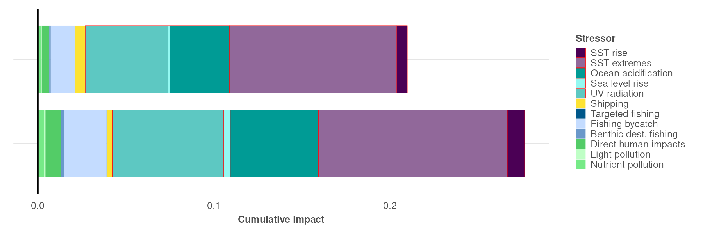
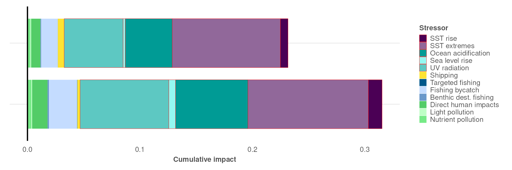

``` {r setup, echo = TRUE, message = FALSE, warning = FALSE}

knitr::opts_chunk$set(echo = TRUE, message = FALSE, warning = FALSE, fig.height = 4, fig.width = 7)

library(terra)
library(sf)
library(oharac)
library(data.table)
library(tidyverse)
library(cowplot)
library(here)
source(here('common_fxns.R'))
source(here('map_fxns.R'))

```

# Summary

Examine distribution of impacts within MPAs - broken down by stressor, mean across cells, both unweighted and weighted by species richness.

# Methods

## Load cumulative impact rasters

Build up an analysis dataframe including impact maps for all stressors.  Include additional layers to facilitate examination of impacts by marine ecoregion.

* Load all impact rasters, plus nspp raster and EEZ raster.
* Crop out all cells not in EEZ
* Summarize both spp-weighted and unweighted mean impact values across all stressors.

```{r build impact dataframe}
imp_fs <- list.files(here_anx('_output/impact_maps/impact_maps_species'), 
                     pattern = 'impact.+_mean.tif',
                     full.names = TRUE)

lyr_names <- basename(imp_fs) %>%
  str_remove_all('impact_spp_|_x_.+|_mean|.tif')
imp_stack_all <- rast(imp_fs) %>%
  setNames(lyr_names)
imp_stack_all[is.na(imp_stack_all)] <- 0
```

```{r load spatial layers}
nspp_r <- rast(here('_output/nspp_maps/species_richness.tif')) %>%
  setNames('nspp')
mpa_r  <- rast(here('_data/mpa_maps/iucn_category.tif')) %>%
  setNames('mpa')

bc_r <- rast(here('_spatial/ocean_bc_1km.tif')) %>%
  setNames('bc_mask')
```

```{r combine all maps}
full_stack <- c(imp_stack_all, nspp_r, mpa_r) %>%
  mask(bc_r)

imp_df <- as.data.frame(full_stack) %>%
  ### Set any protected cell to 1 (TRUE) and unprotected cell to 0 (FALSE)
  mutate(mpa = ifelse(is.na(mpa), 0, 1))
```

### Summarize impacts across MPAs, EEZs

```{r}
imp_unwt_df <- imp_df %>%
  select(-nspp) %>%
  group_by(mpa) %>%
  summarize(across(.cols = everything(), .fns = mean,
                   .names = '{.col}_mean', na.rm = TRUE),
            ncell = n())

imp_nspp_wt_df <- imp_df %>%
  group_by(mpa) %>%
  summarize(across(-nspp, 
                   .fns = ~ sum(.x * nspp, na.rm = TRUE) / sum(nspp[!is.na(.x)]),
                   .names = '{.col}_nspp_wt_mean'),
            nspp_mean = mean(nspp),
            ncell = n()) 

imp_plot_df <- imp_unwt_df %>%
  left_join(imp_nspp_wt_df) %>%
  select(-nspp_mean, -ncell) %>%
  pivot_longer(c(-mpa), names_to = 'str', values_to = 'imp') %>%
  mutate(weighting = ifelse(str_detect(str, 'nspp'), 'species richness', 'unweighted'),
         mpa = ifelse(mpa == 0, 'non-MPA', 'MPA'),
         mpa = factor(mpa, levels = c('MPA', 'non-MPA')),
         str = str_remove_all(str, '_mean.*|_nspp.+')) %>%
  left_join(str_clrs_df, by = c('str' = 'stressor'))
```


### Plot unweighted

```{r}
fill_pal <- str_clrs_df$str_fill

clr_pal  <- str_clrs_df$str_clr

p <- ggplot(data = imp_plot_df %>%
              filter(weighting == 'unweighted'), aes(x = imp, y = mpa)) +
  theme_ohara() +
  ### Fill plus outlines for key
  geom_col(aes(fill = str_lbl, color = str_lbl), 
           width = .8, size = 0.1) +
  scale_fill_manual(values = fill_pal, na.value = NA) +
  scale_color_manual(values = clr_pal, na.value = NA) +
  ### draw a vertical line for left-hand axis (impact = 0)
  geom_vline(xintercept = 0, color = 'black') +
  ### clean up theme
  theme(panel.background = element_blank(),
        text = element_text(family = 'Helvetica'),
        legend.text = element_text(size = 6),
        legend.title = element_text(face = 'bold', size = 6),
        legend.key.size = unit(.22, 'cm'),
        panel.grid.major.x = element_blank(),
        axis.title.y = element_blank(),
        axis.text.y  = element_blank(),
        axis.text.x = element_text(size = 6),
        axis.title.x = element_text(face = 'bold', size = 6, hjust = 0.5)) +
  labs(x = 'Cumulative impact', fill = 'Stressor', color = 'Stressor')
  
ggsave('mpa_impact_summary_unwt.png', height = 2, width = 6, units = 'in')


```

NOTE: MPA on bottom, non-MPA on top.  MPAs tend to be close to shore so more direct human impacts etc.

### Plot spp-richness-weighted

```{r}
p <- ggplot(data = imp_plot_df %>%
              filter(weighting == 'species richness'), aes(x = imp, y = mpa)) +
  theme_ohara() +
  ### Fill plus outlines for key
  geom_col(aes(fill = str_lbl, color = str_lbl), 
           width = .8, size = .1) +
  scale_fill_manual(values = fill_pal, na.value = NA) +
  scale_color_manual(values = clr_pal, na.value = NA) +
  ### draw a vertical line for left-hand axis (impact = 0)
  geom_vline(xintercept = 0, color = 'black') +
  ### clean up theme
  theme(panel.background = element_blank(),
        text = element_text(family = 'Helvetica'),
        legend.text = element_text(size = 6),
        legend.title = element_text(face = 'bold', size = 6),
        legend.key.size = unit(.22, 'cm'),
        panel.grid.major.x = element_blank(),
        axis.title.y = element_blank(),
        axis.text.y  = element_blank(),
        axis.text.x = element_text(size = 6),
        axis.title.x = element_text(face = 'bold', size = 6, hjust = 0.5)) +
  labs(x = 'Cumulative impact', fill = 'Stressor', color = 'Stressor')
  
ggsave('mpa_impact_summary_nsppwt.png', height = 2, width = 6, units = 'in')


```

