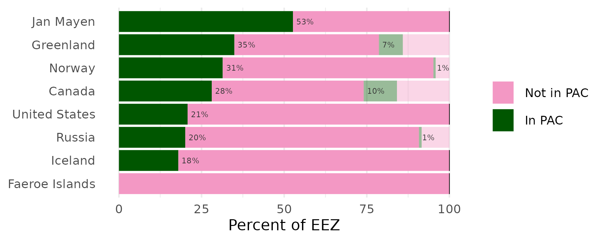
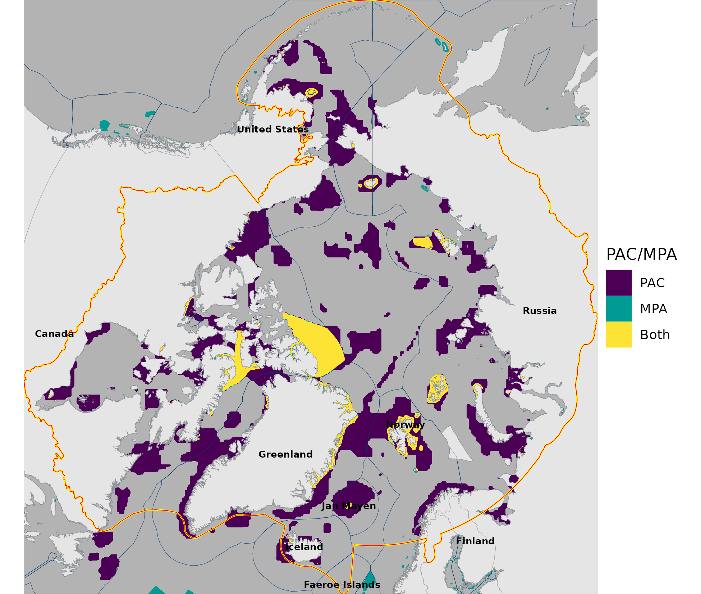

``` {r setup, echo = TRUE, message = FALSE, warning = FALSE}

knitr::opts_chunk$set(echo = TRUE, message = FALSE, warning = FALSE, fig.height = 4, fig.width = 7)

library(terra)
library(sf)
library(oharac)
library(tidyverse)
library(here)
source(here('common_fxns.R'))
source(here('map_fxns.R'))

```

# Summary

Compare PAC zones with existing MPA estate.  Compare per political region, since the PAC polygon is monolithic.

# Data

https://www.protectedplanet.net/en/thematic-areas/wdpa?tab=WDPA

Metadata: https://www.ibat-alliance.org/pdf/wdpa_manual.pdf

# Analysis

## What percent of the circumpolar Arctic is protected by MPAs?

```{r}
arctic_r <- rast(here('_spatial/ocean_polar_1km.tif')) %>%
  setNames('ocean')
iucn_cat_r <- rast(here('_data/mpa_maps/iucn_category.tif')) %>%
  setNames('iucn_cat')
pac_r <- rast(here('_data/mpa_maps/wwf_pacs.tif')) %>%
  setNames('pac')
ice_mask <- rast(here('_spatial/seaice_mask_0.8.tif')) %>%
  setNames('seaice')
eez_r <- rast(here('_spatial/eez_polar_1km.tif')) %>%
  setNames('eez')

pac_df <- as.data.frame(c(arctic_r, iucn_cat_r, pac_r, ice_mask, eez_r),
                        xy = TRUE) %>%
  filter(!is.na(ocean)) %>%
  mutate(seaice = ifelse(is.na(seaice), 0, 1),
         pac    = ifelse(is.na(pac), 0, 1))
```


## What percent of each Arctic country’s waters are protected in PACs?

```{r summary of PAC by EEZ}
eez_rgns <- read_csv(here('_spatial/eez_rgns/rgn_names_ohi.csv')) %>%
  rename(eez = rgn_id) %>%
  mutate(rgn_label = str_remove(rgn_label, 'n Federation| of America'))

eez_pac_df <- pac_df %>%
  group_by(eez, seaice, pac) %>%
  summarize(n_cells = n()) %>%
  ungroup() %>%
  left_join(eez_rgns, by = 'eez')

plot_df <- eez_pac_df %>%
  filter(!is.na(eez)) %>%
  filter(eez < 255) %>%
  group_by(eez) %>%
  mutate(eez_a_km2 = sum(n_cells), 
         pct = n_cells / eez_a_km2) %>%
  ungroup() %>%
  mutate(pac = ifelse(pac, 'In PAC', 'Not in PAC'),
         pac = factor(pac, levels = c('Not in PAC', 'In PAC'))) %>%
  arrange(seaice, desc(pac), -pct) %>%
  mutate(rgn_label = fct_inorder(rgn_label) %>% fct_rev(),
         seaice = factor(seaice)) %>%
  group_by(eez) %>%
  arrange(seaice, desc(pac)) %>%
  mutate(end = cumsum(pct) * 100, 
         start = cumsum(lag(pct, default = 0) * 100)) %>%
  ungroup()

ice_lim_df <- plot_df %>%
  filter(seaice == 0) %>%
  filter(end == max(end)) %>%
  select(rgn_label, end)

pac_pct_df <- plot_df %>%
  filter(pac == 'In PAC') %>%
  mutate(start = ifelse(seaice == 0, end, start)) %>%
  select(rgn_label, start, pct, seaice) %>%
  mutate(pct_lbl = paste0(round(pct * 100), '%'))

rd_gn_pal <- hcl.colors(palette = 'Red-Green', n = 5)[c(2, 5)]

p <- ggplot(plot_df, aes(y = rgn_label)) +
  geom_linerange(aes(xmin = start, xmax = end, 
                     color = pac, alpha = seaice), 
                 size = 7) +
  geom_linerange(data = ice_lim_df,
                 aes(xmin = end - .1, xmax = end + .1), 
                 size = 7, color = 'black') +
  scale_color_manual(values = rd_gn_pal) +
  scale_alpha_manual(values = c(1, .4)) +
  geom_text(data = pac_pct_df, aes(x = start, label = pct_lbl), 
            size = 2, color = 'grey20', hjust = 0, nudge_x = 1) +
  guides(alpha = 'none') +
  theme_minimal() +
  theme(legend.title = element_blank(),
        axis.title.y = element_blank(),
        panel.grid.major.y = element_blank(),
        panel.grid.minor.y = element_blank(),
        legend.key.size = unit(0.4, 'cm')) +
  labs(x = 'Percent of EEZ')

ggsave('pac_by_eez.png', width = 6, height = 2.4)


```

## Map of PACs vs MPAs

```{r map PACs vs MPAs}
ice_mask_poly <- ice_mask %>%
  as.polygons() %>%
  st_as_sf()

pac_mpa_df <- c(arctic_r, iucn_cat_r, pac_r, eez_r) %>%
  as.data.frame(xy = TRUE) %>%
  filter(!is.na(iucn_cat) | !is.na(pac)) %>%
  mutate(pac_mpa = case_when(!is.na(iucn_cat) & is.na(pac) ~ 'MPA',
                             is.na(iucn_cat) & !is.na(pac) ~ 'PAC',
                             !is.na(iucn_cat) & !is.na(pac) ~ 'Both',
                             TRUE ~ 'oops!'),
         pac_mpa = factor(pac_mpa, levels = c('PAC', 'MPA', 'Both')))

p <- ggplot() +
  geom_raster(data = pac_mpa_df, aes(x, y, fill = pac_mpa)) +
  scale_fill_manual(values = hcl.colors(3)) +
  # geom_sf(data = ice_mask_poly, color = 'red', fill = 'white',
  #         size = 0.1, alpha = .6) +
  labs(fill = 'PAC/MPA')

p1 <- format_map(p)

ggsave('pac_mpa_map.png', height = 5.5, width = 6.5, dpi = 300)


```

```{r}
pac_mpa_table <-  c(arctic_r, iucn_cat_r, pac_r, eez_r) %>%
  as.data.frame(xy = TRUE) %>%
  filter(eez < 255) %>%
  group_by(eez) %>%
  summarize(a_tot = sum(!is.na(eez)),
            a_pac = sum(!is.na(pac) & is.na(iucn_cat)),
            a_mpa = sum(!is.na(iucn_cat) & is.na(pac)),
            a_both = sum(!is.na(pac) & !is.na(iucn_cat))) %>%
  mutate(pct_pac = 100 * a_pac / a_tot,
         pct_mpa = 100 * a_mpa / a_tot,
         pct_both = 100 * a_both / a_tot) %>%
  arrange(desc(pct_pac + pct_both)) %>%
  left_join(eez_rgns) %>%
  mutate(pct_pac = paste0(round(pct_pac, 1), '%'),
         pct_mpa = paste0(round(pct_mpa, 1), '%'),
         pct_both = paste0(round(pct_both, 1), '%')) %>%
  select(`Region` = rgn_label,
         `Area (km^2)` = a_tot,
         `PAC only` = pct_pac,
         `MPA only` = pct_mpa,
         `PAC & MPA` = pct_both)
  
knitr::kable(pac_mpa_table)
```

